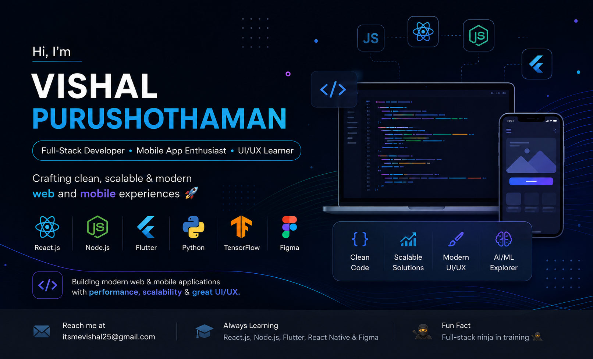

  

---

  

---

# 🌐 Connect With Me

  

  

  

# 🛠️ Tech Stack

## 🚀 Languages

  

---

## ⚙️ Frameworks & Libraries

  

---

## 🤖 AI / ML Stack

  
  

---

## 🎨 Design & Productivity Tools

  

---

# 📊 GitHub Stats

  

  

  

  

---

  

  💙 Thanks for visiting my profile!
   
  ⭐ Feel free to explore my repositories and projects.

